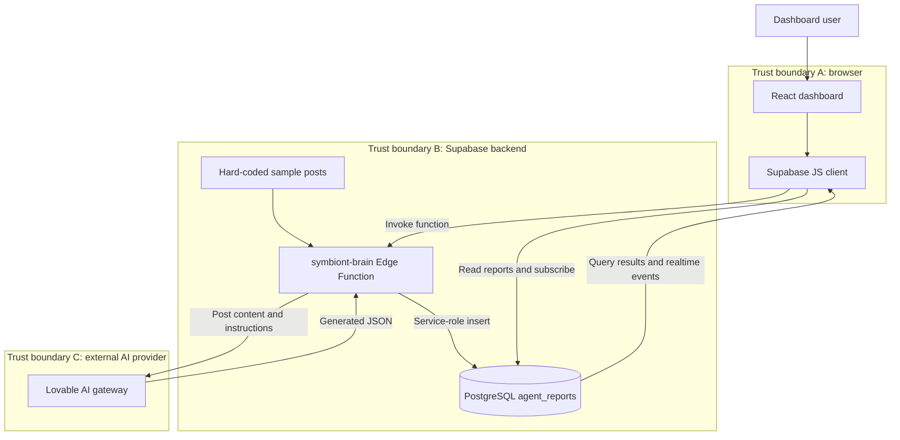

# Symbiont — data flow and trust boundaries

This diagram describes the **current implementation on main**, not the proposed fixes in PR #2.

## Security-relevant data flow

1. A dashboard user invokes the Edge Function through the Supabase client.
2. The function selects a hard-coded sample post; no live social-platform ingestion is demonstrated in this path.
3. The function sends the sample post and classification instructions to the external Lovable AI gateway.
4. The model returns generated JSON. The current `main` implementation parses it and uses a misleading default classification when parsing fails.
5. The function writes a report to `agent_reports` with its service-role client.
6. The browser queries stored reports and receives realtime insertion events.

**Verified configuration:** `supabase/config.toml` sets `verify_jwt = false` on `main`. PR #2 proposes changing that configuration and adding server-side token verification and output allowlists. Those fixes are **not** shown as deployed or merged.

**Data provenance:** A sample post is not a verified social-platform observation. **Model output:** Valid JSON alone does not establish accurate sentiment, county or risk. **Authorization:** A browser route guard is not a substitute for server-enforced permissions. **Privacy:** Future live ingestion requires a legal basis, minimization, retention and access controls.
