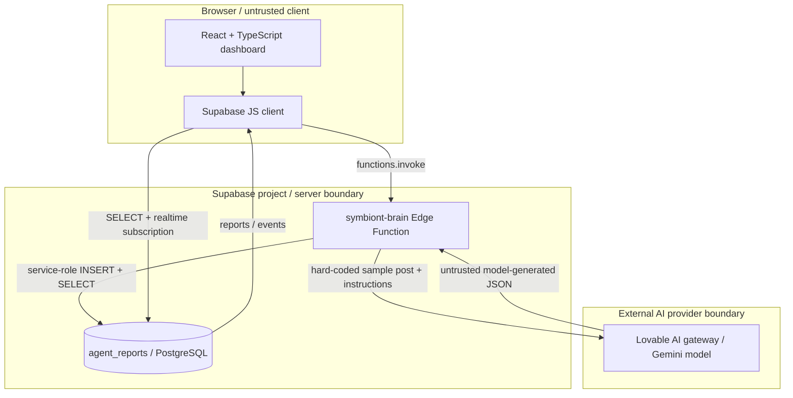

# Symbiont — verified system architecture

**Source:** `main` inspected October 2026. **Status:** code-level assessment, not a deployment audit.

## Verified components

- `src/hooks/useAgentReports.tsx`: SELECT (100 most recent), realtime INSERT subscription, and Edge Function invocation.
- `supabase/functions/symbiont-brain/index.ts`: hard-coded `MOCK_POSTS`, Lovable AI gateway request, JSON parsing and fallback, service-role database insertion.
- `supabase/config.toml`: `verify_jwt = false` for the function.
- `src/components/common/SimulatedDataProvider.tsx`: client-side simulated feeds.
- `src/components/common/ProtectedRoute.tsx`: browser-side navigation guard; not evidence of server-side authorization.

## Not established by this review

Runtime network exposure, deployed configuration, actual database RLS policy effectiveness, key compromise, AI classification accuracy, and production traffic. Verify independently before describing these as tested.
