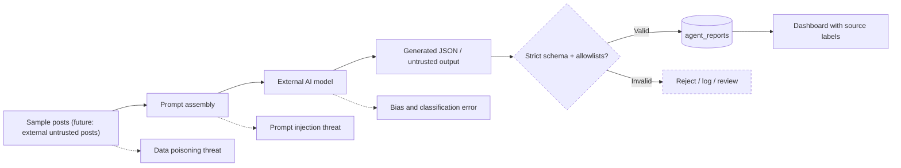

# Symbiont — AI trust and attack boundaries

**Important:** The strict validator and rejection path are **recommended controls**, not currently verified as implemented. Current code parses JSON and inserts values, or writes Neutral/Nairobi/Low on parse failure.

Recommended validation: explicit allowed sentiment and risk enumerations, known county list, length bounds, request timeout, reject-on-failure, classification provenance and model-version metadata. Treat every social post as data, never as instructions. Evaluate adversarial posts and Swahili/Sheng/code-switched samples before making accuracy claims.
